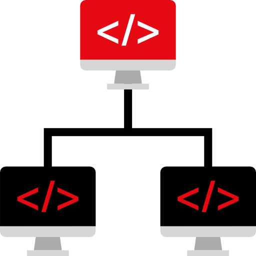
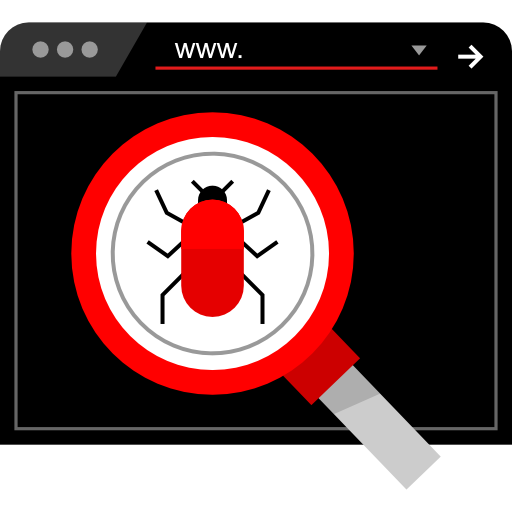

<table>
 <tr>
<td align="center"><a href="./WebDev-Sec"> <b>Web Development Security</b></a>  <a href="./WebDev-Sec/getting-started.md">Getting Started</a></td>
   <td align="center"><a href="./Network-Security"> <b>Network Security</b></a>  <a href="./Network-Security/getting-started.md">Getting Started</a> <a href="./Network-Security/practice.md">Practice</a></td>
   

   <td align="center"><a href="./CTF"> <b>Capture The Flag</b></a>  <a href="./CTF/getting-started.md">Getting Started</a> <a href="./CTF/tools.md">Tools</a> <a href="./CTF/writeups/readme.md">Writeups</a></td>

 
   <td align="center"><a href="./Bug-Bounty"> <b>Bug Bounty Hunting</b></a>  <a href="./Bug-Bounty/getting-started.md">Getting Started</a> <a href="./Bug-Bounty/tools.m">Tools</a> <a href="./Bug-Bounty/practice.md">Practice</a></td>
   
   
   
   
  
  <td align="center"><a href="./CTF"> <b>Capture The Flag</b></a>  <a href="./CTF/getting-started.md">Getting Started</a> <a href="./CTF/tools.md">Tools</a> <a href="./CTF/writeups/readme.md">Writeups</a></td>
  
  <td align="center" ><a href="./OSCP"> <b>Offensive Security Certified Professional</b></a>  <a href="./OSCP/preparation.md">Preparation</a> <a href="./OSCP/practice.md">Practice</a></td>
    
    

  </tr>

   
   
 </table>

********************************************

*********************************************
## License

This project is licensed under the MIT License - Copyright (c) 2019 Tikam Alma

